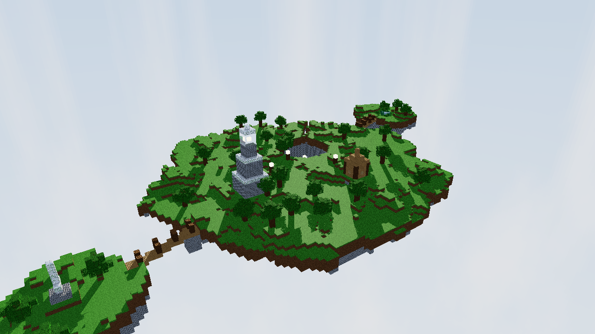
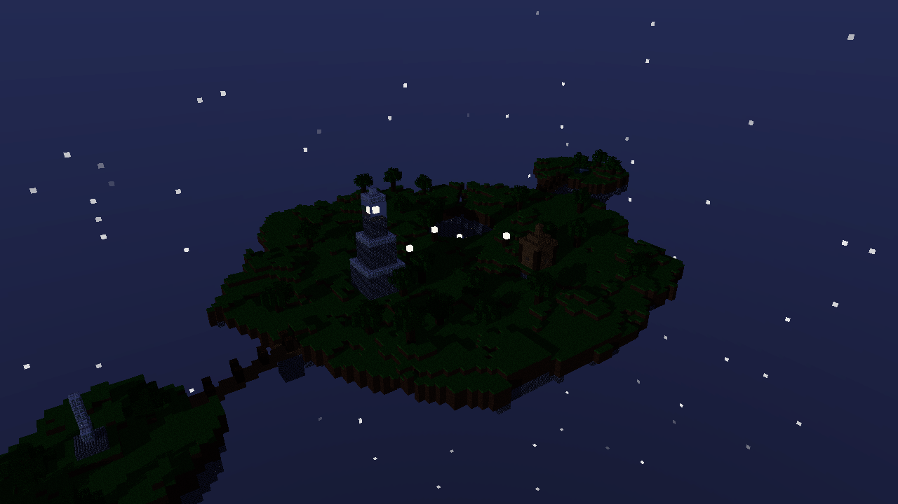
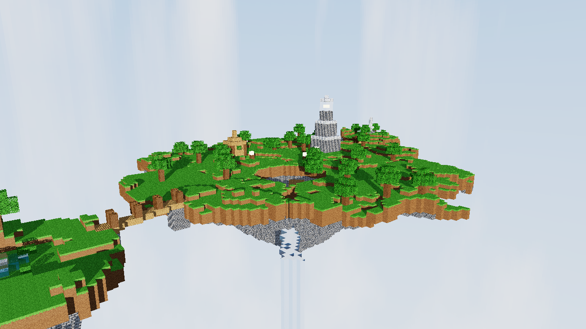
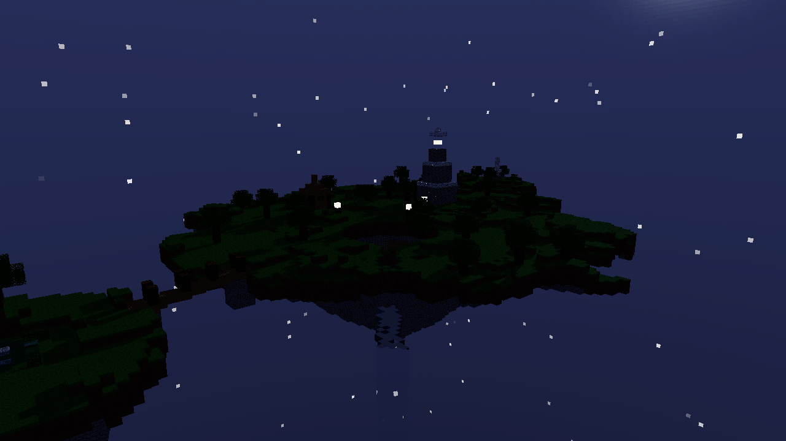
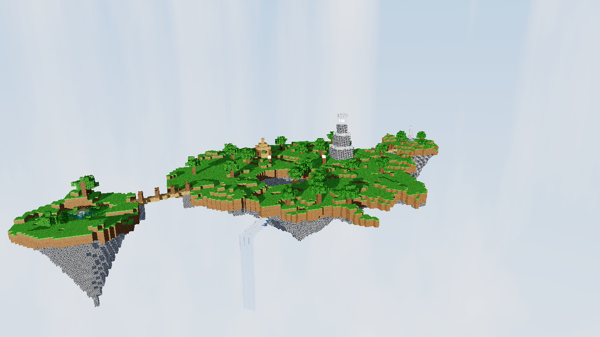
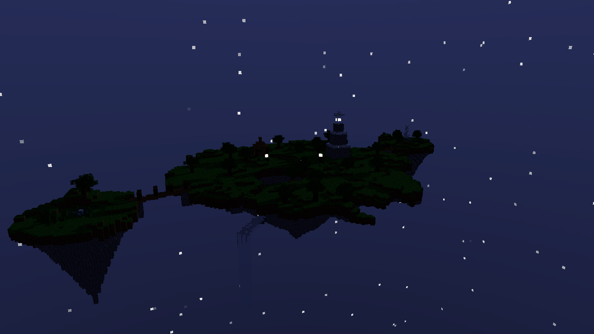
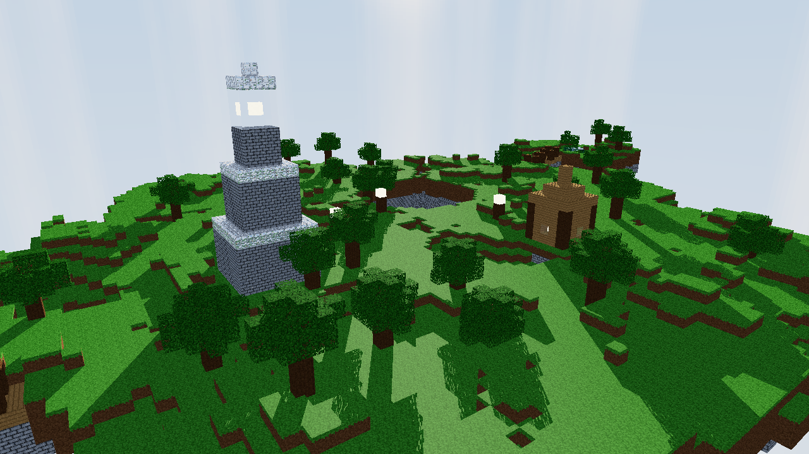
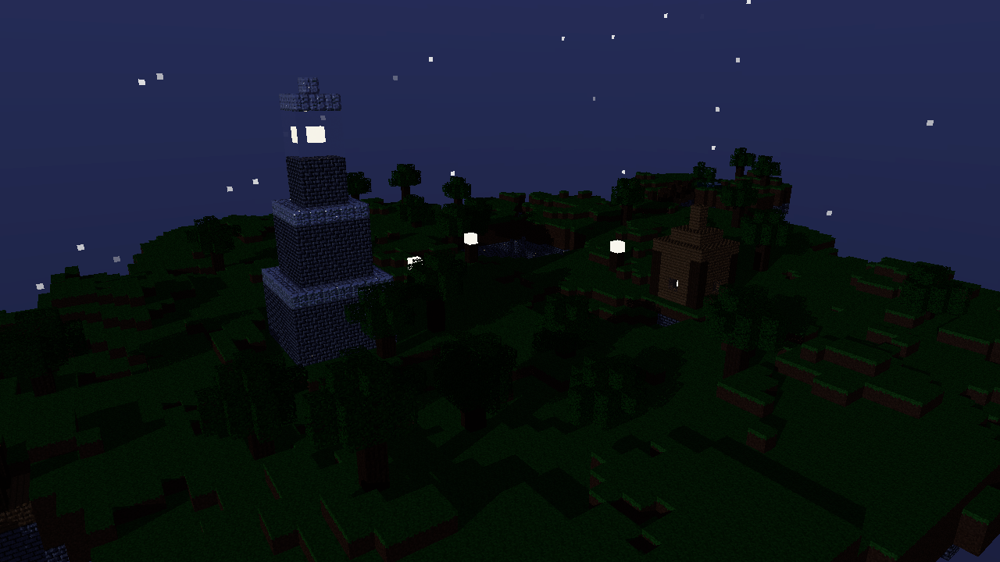

# La isla del faro

Diorama estilo Minecraft renderizado 100% con raytracing en CPU, escrito en
Rust desde cero (sin librerias externas para la logica: matematica,
texturas, ruido, PRNG, paralelismo y raytracing son todo codigo propio). Una
isla flotante generada proceduralmente con un faro, un lago con cascada, un
muelle, una casita, dos islas satelite y postes de luz.



## Video

<!-- VIDEO AQUÍ -->

## Requisitos

- Rust (edition 2021) con `cargo`.
- La unica dependencia externa es `raylib` (ventana, teclado/mouse y
  framebuffer). Todo lo demas -- matematica, texturas, PNG, ruido, PRNG,
  paralelismo, raytracing -- es codigo propio sobre la std.

## Como correr

```
cargo run --release
```

Abre una ventana con la escena en vivo. Tambien hay dos modos sin ventana,
utiles para revisar el trabajo o medir rendimiento:

```
# Renderiza un frame a PNG y termina
cargo run --release -- --render salida.png --yaw 235 --pitch 25 --dist 110 --width 1280 --height 720 [--night] [--seed 7] [--no-normalmaps]

# Renderiza 30 frames desde 3 vistas fijas e imprime ms/frame promedio y FPS equivalente
cargo run --release -- --bench
```

## Controles

| Tecla / accion | Efecto |
|---|---|
| A / D o flechas izq/der | Rotar el diorama (yaw) |
| W / S o flechas arriba/abajo | Cambiar el angulo de camara (pitch) |
| Q / E o rueda del mouse | Zoom |
| R | Activa/desactiva la auto-rotacion |
| T | Alterna dia / noche |
| N | Activa/desactiva los normal maps |
| G | Regenera el terreno con una nueva semilla |
| 1 / 2 / 3 | Calidad baja / media / alta |
| Esc | Salir |

El HUD (arriba a la izquierda, fuente bitmap 5x7 propia) muestra FPS, ms por
frame, modo de resolucion activo, resolucion interna, semilla, modo dia/
noche, calidad, normal maps on/off y el tiempo de generacion del terreno.

## Materiales

Cada material tiene su propia textura (16x16, generada por codigo si no hay
un `.bmp` en `assets/textures/`) y sus propios parametros de shading.

| Material | Textura | Albedo | Specular (coef/exp) | Transparencia | Reflectividad | IOR | Emision |
|---|---|---|---|---|---|---|---|
| Grass | verde con variacion, lado con franja de tierra | verde/marron | 0.05 / 8 | 0 | 0 | 1.0 | - |
| Dirt | marron con ruido | marron | 0.03 / 6 | 0 | 0 | 1.0 | - |
| Sand | tostado claro | beige | 0.05 / 10 | 0 | 0 | 1.0 | - |
| Stone bricks | ladrillos con juntas oscuras | gris | 0.15 / 24 | 0 | 0.05 | 1.0 | - |
| Oak log | vetas verticales (lado), anillos (tapa) | marron | 0.05 / 8 | 0 | 0 | 1.0 | - |
| Oak planks | tablas con juntas y vetas | marron claro | 0.08 / 12 | 0 | 0 | 1.0 | - |
| Leaves | verde con alpha cutout | verde | 0.02 / 4 | 0 | 0 | 1.0 | - |
| Water | ondas suaves, absorcion Beer-Lambert | azul-verde | 0.6 / 90 | 0.85 | 0.08 | 1.33 | - |
| Glass | marco claro, centro casi transparente | casi blanco | 0.6 / 120 | 0.92 | 0.06 | 1.5 | - |
| Glowstone | manchas amarillas brillantes | amarillo/naranja | 0 / 1 | 0 | 0 | 1.0 | (1.0, 0.85, 0.5) x 2.5 |
| Iron block | gris metalico con borde | gris claro | 0.4 / 60 | 0 | 0.55 | 1.0 | - |
| Lamp frame | marco oscuro, centro con cutout | gris oscuro | 0.1 / 20 | 0 | 0 | 1.0 | - |

`stone_bricks`, `oak_planks`, `oak_log` e `iron_block` ademas tienen normal
map real (derivado por Sobel de su propia textura, o cargado desde
`assets/textures/<nombre>_n.bmp` si existe).

## Tecnicas usadas

- **DDA (Amanatides & Woo)**: el mundo es una grilla de voxeles; cada rayo
  primero se prueba contra el AABB total (slab method) y luego recorre
  voxel por voxel hasta el primero que corresponda, con un predicado que
  decide si atravesarlo (aire, cutout de hojas/marcos, mismo material
  transparente contiguo) o detenerse ahi.
- **Fresnel (Schlick) y Snell**: la reflexion y la refraccion se calculan
  juntas -- Snell da la direccion refractada con el IOR del material,
  Fresnel-Schlick reparte cuanta energia va a reflexion y cuanta a
  refraccion segun el angulo de incidencia; la reflexion interna total
  redirige toda la energia a reflexion.
- **Beer-Lambert**: la luz que atraviesa un medio transparente (el agua) se
  atenua por canal segun la distancia real recorrida dentro del volumen.
- **Normal maps con TBN**: cada cara del cubo tiene una tangente/bitangente
  fija coherente con sus UV; el normal map (cargado o derivado por Sobel de
  la textura) perturba la normal en ese espacio antes de calcular difusa,
  especular, reflexion y refraccion.
- **Cubemap**: el skybox es un cubo de 6 caras de 256x256, generado con
  fBm (nubes), un campo de estrellas por hash y discos de sol/luna con
  glow; se usa para todo rayo que no pega, incluidos los reflejados.
- **Perlin / fBm**: ruido Perlin 2D/3D con permutacion generada desde una
  semilla (PCG32 propio), sumado en octavas (fBm) para el heightmap de la
  isla, la deformacion de su borde, la base conica y las nubes del cielo.
- **Paralelismo por tiles**: el framebuffer se reparte en tiles de 16x16
  tomados de una cola atomica (`AtomicUsize`) por `std::thread::scope`, sin
  `Mutex` en el camino caliente, balanceando zonas caras y baratas entre
  todos los hilos disponibles.
- **Resolucion adaptativa**: mientras la camara se mueve, la ventana
  renderiza a la mitad de la resolucion interna y escala; al soltar, hace
  un pase a resolucion completa (con supersampling 2x2 opcional en calidad
  alta).

## Rendimiento

Medido con `cargo run --release -- --bench` en esta maquina (20 hilos
detectados), sobre la escena completa de la isla del faro:

| Resolucion | ms/frame | FPS equivalente |
|---|---|---|
| 480x270 | 9.1 | ~110 |
| 960x540 | 34.5 | ~29 |

Detalle de que se optimizo (cero asignaciones por rayo, camara precomputada
por frame, bounds checks evitados, resolucion adaptativa) en `BENCHMARK.md`.

## Galeria

| De dia | De noche |
|---|---|
|  |  |
|  |  |
|  |  |
|  |  |

## Guion sugerido para el video

1. Arrancar con la vista inicial (3/4, faro + lago + casita en cuadro) unos
   segundos quieto.
2. Activar auto-rotacion (`R`) para dar una vuelta completa al diorama.
3. Detener la rotacion, hacer zoom (`Q`/`E` o rueda) hacia el faro y el
   cuarto de linterna.
4. Acercarse al lago: mostrar la refraccion del fondo a traves del agua y
   la cascada cayendo por el borde de la isla.
5. Cruzar el puente hacia el monolito de hierro pulido (mostrar el reflejo)
   y hacia el jardin con la fuente.
6. Alternar dia/noche (`T`): mostrar el faro, el muelle y los postes de luz
   encendidos, y la casita iluminada por dentro vista desde afuera.
7. Alternar normal maps (`N`) de cerca sobre la pared del faro (stone
   bricks) para mostrar la diferencia con luz rasante.
8. Regenerar el terreno (`G`) un par de veces para mostrar que la escena se
   reconstruye completa con cualquier semilla.
