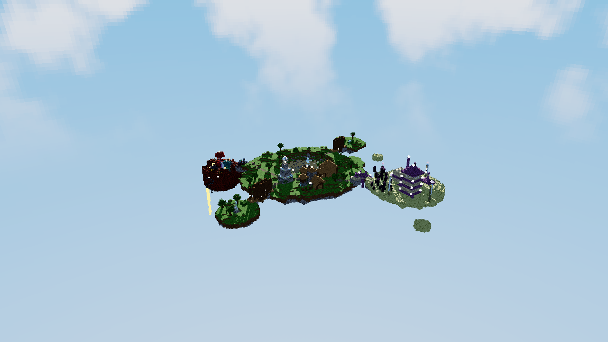
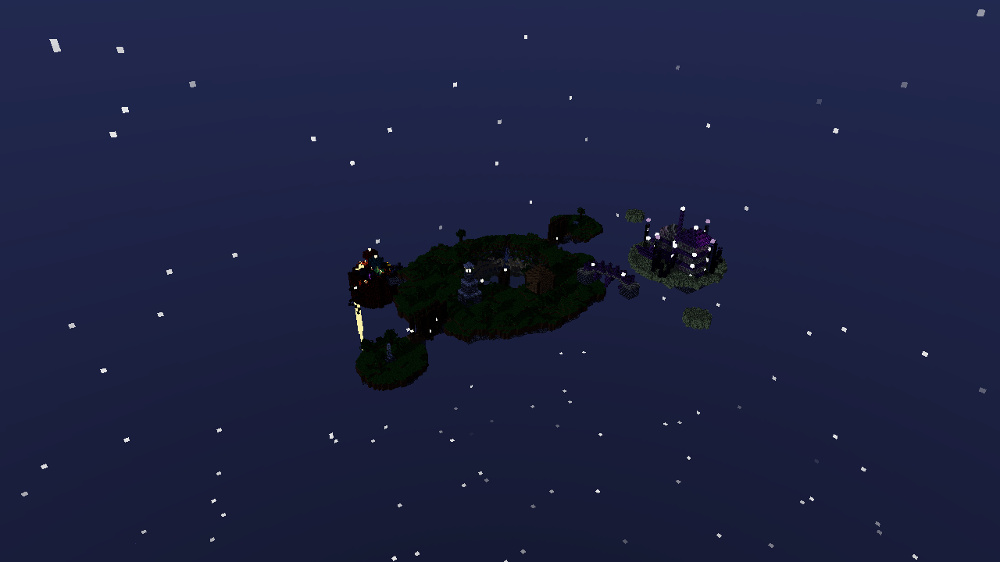
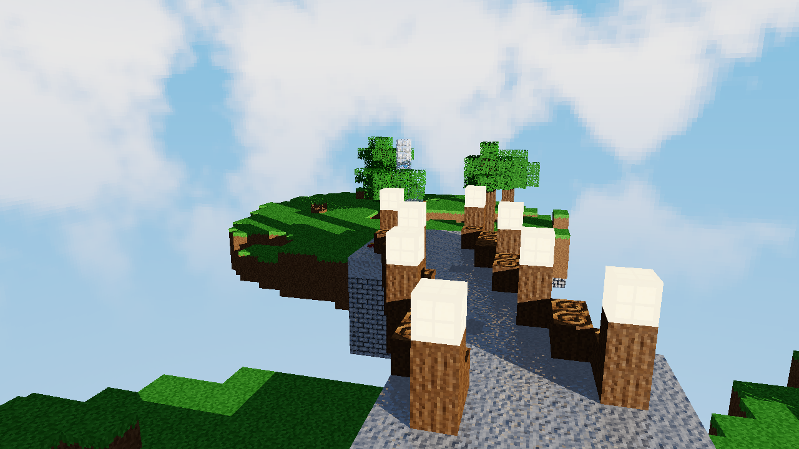
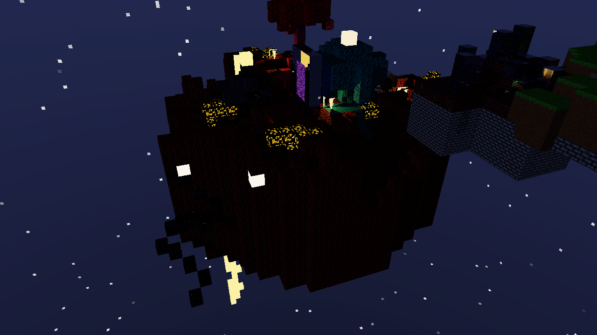
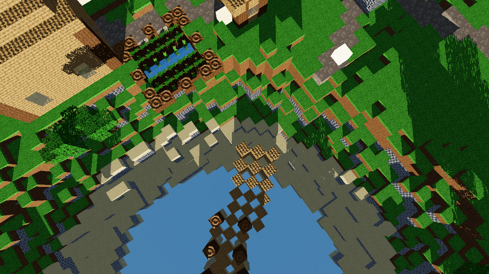
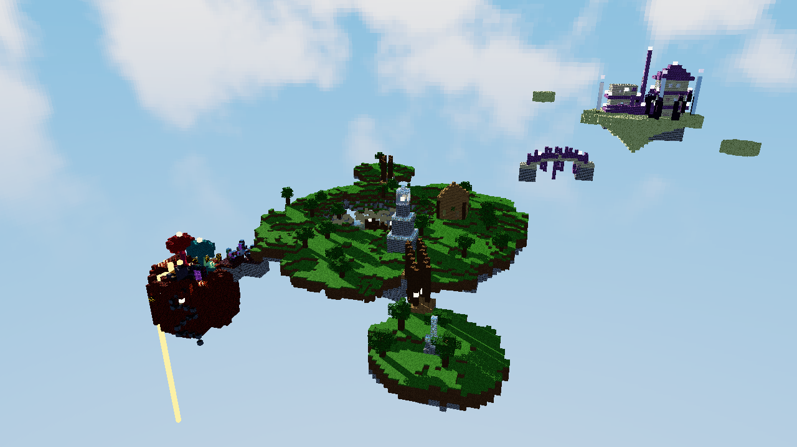

# El archipielago del faro

<!--
  VIDEO: pegar aca el link/embed una vez grabado (ver record.md para
  generar los cuadros con `--record` y unirlos con ffmpeg en diorama.mp4).
  Tres formatos posibles, usa el que corresponda y borra los otros:

  - YouTube con portada propia (recomendado: guarda un frame lindo del
    render como renders/portada.png y reemplaza URL_DEL_VIDEO):
    [](URL_DEL_VIDEO)

  - YouTube con la miniatura automatica (sin necesitar renders/portada.png,
    reemplaza VIDEO_ID):
    [](https://www.youtube.com/watch?v=VIDEO_ID)

  - Archivo directo (GitHub Releases, Drive, etc.) o solo un link de texto:
    [Ver video](URL_DEL_VIDEO)
-->

Diorama estilo Minecraft renderizado 100% con raytracing en CPU, escrito en
Rust desde cero (sin librerias externas para la logica: matematica,
texturas, ruido, PRNG, paralelismo y raytracing son todo codigo propio).
Cinco islas flotantes generadas proceduralmente, cada una con su propio
perfil de terreno: la isla principal (faro, lago con cascada, muelle,
casita, dos islas satelite), una isla compacta del Nether (arboles hongo
carmesi/distorsionado, formacion de blackstone con lava, fuegos, portal) y
una isla del End con una ciudad de torres de purpur, unidas por puentes de
verdad (tablero ancho, barandas, arcos o cables, linternas).



## Requisitos

- Rust (edition 2021) con `cargo`.
- La unica dependencia externa es `raylib` (ventana, teclado/mouse y
  framebuffer). Todo lo demas -- matematica, texturas, PNG, ruido, PRNG,
  paralelismo, raytracing -- es codigo propio sobre la std.

## Como correr

```
cargo run --release
```

Abre una ventana con la escena en vivo. Tambien hay tres modos sin ventana,
utiles para revisar el trabajo o medir rendimiento:

```
# Renderiza un frame a PNG y termina (--dist hasta ~radio_principal x 9
# para que las 5 islas entren en cuadro, ver Controles)
cargo run --release -- --render salida.png --yaw 235 --pitch 30 --dist 260 --width 1280 --height 720 [--night] [--seed 7] [--no-normalmaps]

# Renderiza 30 frames desde 3 vistas fijas e imprime ms/frame promedio y FPS equivalente
cargo run --release -- --bench

# Mide el refinamiento progresivo del pase quieto pasada por pasada (sin ventana)
cargo run --release -- --bench-aa
```

## Controles

| Tecla / accion | Efecto |
|---|---|
| A / D o flechas izq/der | Rotar el diorama (yaw) |
| W / S o flechas arriba/abajo | Cambiar el angulo de camara (pitch) |
| Q / E o rueda del mouse | Zoom (alcanza para ver las 5 islas a la vez) |
| R | Activa/desactiva la auto-rotacion |
| T | Alterna dia / noche |
| N | Activa/desactiva los normal maps |
| G | Regenera las 5 islas con una nueva semilla derivada |
| 1 / 2 / 3 | Calidad baja / media / alta |
| 4 / 5 / 6 | Centra la camara (con transicion suave) en la isla principal / Nether / End |
| Esc | Salir |

El HUD (arriba a la izquierda, fuente bitmap 5x7 propia) muestra FPS, ms por
frame, modo de resolucion activo (o la pasada de refinamiento progresivo en
curso, `PASE X/Y`), resolucion interna, semilla, modo dia/noche, calidad,
normal maps on/off y el tiempo de generacion del terreno.

## Materiales

Cada material tiene su propia textura (16x16, generada por codigo si no hay
un `.bmp` en `assets/textures/`) y sus propios parametros de shading. 39 en
total, organizados por donde viven en la escena.

### Base (isla principal y satelites)

| Material | Textura | Albedo | Specular (coef/exp) | Transparencia | Reflectividad | IOR | Emision |
|---|---|---|---|---|---|---|---|
| Grass | verde con variacion, lado con franja de tierra | verde/marron | 0.05 / 8 | 0 | 0 | 1.0 | - |
| Dirt | marron con ruido | marron | 0.03 / 6 | 0 | 0 | 1.0 | - |
| Sand | tostado claro | beige | 0.05 / 10 | 0 | 0 | 1.0 | - |
| Stone bricks | ladrillos con juntas oscuras, normal map | gris | 0.15 / 24 | 0 | 0.05 | 1.0 | - |
| Oak log | vetas verticales (lado), anillos (tapa), normal map | marron | 0.05 / 8 | 0 | 0 | 1.0 | - |
| Oak planks | tablas con juntas y vetas, normal map | marron claro | 0.08 / 12 | 0 | 0 | 1.0 | - |
| Leaves | verde con alpha cutout | verde | 0.02 / 4 | 0 | 0 | 1.0 | - |
| Water | ondas suaves, absorcion Beer-Lambert | azul-turquesa | 0.6 / 90 | 0.85 | 0.30 | 1.33 | - |
| Glass | marco claro, centro casi transparente | casi blanco | 0.6 / 120 | 0.92 | 0.06 | 1.5 | - |
| Glowstone | manchas amarillas brillantes | amarillo/naranja | 0 / 1 | 0 | 0 | 1.0 | (1.0, 0.85, 0.5) x 2.5 |
| Iron block | gris metalico con borde, normal map | gris claro | 0.4 / 60 | 0 | 0.55 | 1.0 | - |
| Lamp frame | marco oscuro, centro con cutout | gris oscuro | 0.1 / 20 | 0 | 0 | 1.0 | - |

### Nether

| Material | Textura | Albedo | Specular (coef/exp) | Transparencia | Reflectividad | IOR | Emision |
|---|---|---|---|---|---|---|---|
| Netherrack | rugosa, pozos oscuros, normal map | rojo oscuro | 0.04 / 6 | 0 | 0 | 1.0 | - |
| Nether bricks | ladrillo con juntas, normal map | rojo oscuro | 0.12 / 20 | 0 | 0.03 | 1.0 | - |
| Lava | ondas, opaca | naranja intenso | 0.3 / 40 | 0 | 0 | 1.0 | (1.0, 0.45, 0.08) x 3.2 |
| Obsidian | casi negra con motas moradas | negro/morado | 0.5 / 80 | 0 | 0.35 | 1.0 | - |
| Portal | normal map propio en remolino "magico" | morado translucido | 0.4 / 30 | 0.85 | 0.05 | 1.1 | (0.55, 0.15, 0.85) x 0.6 |
| Magma | grietas via mapa de emision separado del albedo | roca oscura + grietas | 0.1 / 10 | 0 | 0 | 1.0 | solo en las grietas |
| Basalt | rayado vertical por columnas | gris azulado | 0.1 / 14 | 0 | 0 | 1.0 | - |
| Crimson stem | vetas verticales, normal map | rosa/magenta | 0.05 / 8 | 0 | 0 | 1.0 | - |
| Warped stem | vetas verticales, normal map | turquesa | 0.05 / 8 | 0 | 0 | 1.0 | - |
| Nether wart block | bultos irregulares, normal map | rojo oscuro | 0.02 / 4 | 0 | 0 | 1.0 | - |
| Warped wart block | bultos irregulares, normal map | turquesa oscuro | 0.02 / 4 | 0 | 0 | 1.0 | - |
| Shroomlight | manchas calidas | naranja/amarillo | 0.1 / 10 | 0 | 0 | 1.0 | (1.0, 0.6, 0.25) x 2.2 |
| Crimson nylium | uniforme (cara de abajo: netherrack) | rojo/magenta | 0.04 / 6 | 0 | 0 | 1.0 | - |
| Warped nylium | uniforme (cara de abajo: netherrack) | turquesa | 0.04 / 6 | 0 | 0 | 1.0 | - |
| Blackstone | motas claras dispersas, normal map | gris muy oscuro | 0.15 / 22 | 0 | 0.04 | 1.0 | - |
| Fire | silueta de llama recortada (alpha cutout) | naranja/amarillo | 0 / 1 | 0 | 0 | 1.0 | (1.0, 0.55, 0.15) x 2.0 |
| Soul fire | silueta de llama recortada (alpha cutout) | celeste/azul | 0 / 1 | 0 | 0 | 1.0 | (0.3, 0.75, 1.0) x 2.0 |
| Soul sand | punteado oscuro | gris violaceo | 0.02 / 4 | 0 | 0 | 1.0 | - |

### End

| Material | Textura | Albedo | Specular (coef/exp) | Transparencia | Reflectividad | IOR | Emision |
|---|---|---|---|---|---|---|---|
| End stone | motas oscuras dispersas, normal map | amarillo verdoso palido | 0.06 / 10 | 0 | 0 | 1.0 | - |
| End stone bricks | ladrillo claro, normal map | amarillo palido | 0.1 / 16 | 0 | 0 | 1.0 | - |
| Purpur | cuadricula, normal map | morado | 0.25 / 30 | 0 | 0 | 1.0 | - |
| Purpur pillar | rayas en columna, normal map | morado | 0.28 / 32 | 0 | 0 | 1.0 | - |
| End crystal | gradiente radial | rosa/morado | 0.7 / 100 | 0.6 | 0.5 | 1.6 | (0.9, 0.55, 1.0) x 1.8 |
| End rod | bloque entero, lampara | blanco | 0.3 / 40 | 0 | 0 | 1.0 | (0.9, 0.95, 1.0) x 2.0 |
| Chorus (flor) | planta con alpha cutout | morado claro | 0.05 / 6 | 0 | 0 | 1.0 | - |
| Chorus plant (tallo) | solido con nudos | morado oscuro | 0.04 / 6 | 0 | 0 | 1.0 | - |
| Magenta glass | marco claro, centro casi transparente | magenta | 0.6 / 120 | 0.85 | 0.08 | 1.5 | - |

Normal map real (derivado por Sobel de la propia textura, o cargado desde
`assets/textures/<nombre>_n.bmp` si existe) en: `stone_bricks`,
`oak_planks`, `oak_log`, `iron_block`, `netherrack`, `nether_bricks`,
`crimson_stem`, `warped_stem`, `nether_wart_block`, `warped_wart_block`,
`blackstone`, `end_stone`, `end_stone_bricks`, `purpur`, `purpur_pillar`.
El `portal` tiene un normal map propio generado aparte (no derivado del
albedo): un remolino via atan2/seno/coseno, para que la refraccion se vea
distorsionada en vez de plana.

## Tecnicas usadas

- **DDA multi-isla (Amanatides & Woo)**: cada isla (y cada puente, y cada
  mini-isla de descanso) es su propia grilla de voxeles con un offset
  entero que la ubica en el mundo (`src/islands.rs`). Un rayo primero se
  prueba contra el AABB de cada isla (sin asignar memoria, ordenado por t
  de entrada) y solo corre el DDA voxel a voxel dentro de las que
  realmente puede llegar a tocar. Sombras, reflejos y refracciones cruzan
  islas sin logica especial.
- **Puentes reutilizables con curva real**: `BridgeStyle` +
  `build_bridge_span` arman cada puente como su propia mini-isla, con el
  tablero siguiendo una catenaria (colgantes) o un arco (de piedra),
  pasamanos continuo con postes, linternas cada 6 pasos, y subestructura
  visible debajo (vigas cruzadas + cuerdas colgando de pilares altos, o
  arcos de soporte + estalactita). Si el hueco entre dos islas es muy
  grande, se insertan mini-islas de descanso en el medio.
- **Fresnel (Schlick) y Snell**: la reflexion y la refraccion se calculan
  juntas -- Snell da la direccion refractada con el IOR del material,
  Fresnel-Schlick reparte cuanta energia va a reflexion y cuanta a
  refraccion segun el angulo de incidencia; la reflexion interna total
  redirige toda la energia a reflexion.
- **Beer-Lambert por medio, no por voxel**: la luz que atraviesa un medio
  transparente (agua, portal, vidrio) se atenua por canal segun la
  distancia REAL recorrida dentro del volumen completo -- tanto para el
  rayo de vista como para el de sombra, que rastrea el medio actual igual
  que los rayos primarios en vez de tratar cada voxel interno como una
  superficie separada.
- **Normal maps con TBN**: cada cara del cubo tiene una tangente/bitangente
  fija coherente con sus UV; el normal map (cargado, derivado por Sobel de
  la textura, o generado aparte como el remolino del portal) perturba la
  normal antes de calcular difusa, especular, reflexion y refraccion.
- **Emision por mapa**: ademas de la emision plana por material (glowstone,
  lava, end_rod, end_crystal, shroomlight, fire, soul_fire), el magma usa
  un mapa de emision separado del albedo (mismo patron de grietas, pixel a
  pixel) para que solo las grietas brillen, no todo el bloque.
- **Cubemap continuo en 3D**: el skybox es un cubo de 6 caras de 256x256;
  las nubes se generan con fBm 3D muestreado sobre la direccion normalizada
  (no 2D por cara), asi son continuas entre caras sin costuras ni
  estiramiento, con una banda de densidad cerca del horizonte que se
  desvanece hacia el cenit y hacia abajo. Campo de estrellas por hash y
  discos de sol/luna con glow de noche.
- **Perlin / fBm, tres perfiles distintos**: ruido Perlin 2D/3D con
  permutacion generada desde una semilla (PCG32 propio). La isla principal
  usa fBm suave normal; el Nether pliega el fBm sobre si mismo ("ridged")
  para picos filosos y grietas; el End usa poca amplitud redondeada a
  escalones de 2 bloques (terrazas) y casi nada de deformacion de borde.
- **Paralelismo por tiles**: el framebuffer se reparte en tiles de 16x16
  tomados de una cola atomica (`AtomicUsize`) por `std::thread::scope`, sin
  `Mutex` en el camino caliente.
- **Refinamiento progresivo y adaptativo**: la ventana siempre corre a
  resolucion real (1:1, minimo 1280x720). Mientras la camara se mueve,
  renderiza a una fraccion segun calidad y escala con nearest-neighbor. Al
  soltar, el pase quieto NO bloquea de una vez: la pasada 0 tira 1
  muestra/pixel sobre todo el frame (algo nitido de inmediato), calcula
  una mascara de contraste, y las pasadas siguientes (una por frame, sin
  bloquear los controles) solo refinan los pixeles de alto contraste hasta
  completar la calidad elegida. Se cancela si la camara se mueve.

## Rendimiento

Medido con `cargo run --release -- --bench` en esta maquina (20 hilos
detectados), sobre la escena completa (principal + 2 satelite + Nether +
End + todos sus puentes/caminos y mini-islas):

| Resolucion | ms/frame | FPS equivalente |
|---|---|---|
| 640x360 (resolucion del pase "en movimiento" a calidad media) | 49.5 | ~20 |
| 1280x720 | 178.2 | ~5.6 |

Rotando a calidad media la ventana corre a resolucion reducida (~20 FPS
equivalente, fluido); el pase de resolucion completa es ahora PROGRESIVO
(ver "Refinamiento progresivo" arriba), asi que nunca bloquea de una sola
vez aunque tarde varios cientos de ms en total. El costo subio un poco
respecto a partes anteriores (mas islas: Nether y End compactas pero con
mucho contenido nuevo, mas mini-islas de puentes/descanso) pero se
mantiene fluido para rotar; no hizo falta optimizacion adicional (limite
de luces por punto, profundidad de recursion, early exits ya estaban
puestos desde antes). Detalle completo, incluido el desglose pasada por
pasada del refinamiento progresivo, en `BENCHMARK.md`.

## Galeria

| De dia | De noche |
|---|---|
|  |  |
|  |  |
|  |  |

## Guion sugerido para el video

1. Arrancar con la vista general (zoom alejado, las 5 islas -- principal,
   sus 2 satelites, Nether y End -- en un solo cuadro, puentes bien
   visibles entre todas) unos segundos quieto.
2. Activar auto-rotacion (`R`) para dar una vuelta completa al archipielago.
3. Detener la rotacion. Cruzar uno de los puentes colgantes de madera hacia
   el monolito de hierro (reflejo) mostrando el tablero curvo, las
   barandas y las cuerdas colgando de los pilares.
4. Tecla `5` para centrar suavemente la camara en el Nether, alternar a
   noche (`T`) y hacer zoom (`Q`/`E`) hacia los arboles hongo (carmesi y
   distorsionado), la formacion de blackstone con la cascada de lava, los
   fuegos y el portal -- mostrar lo imponente que se ve de noche.
5. Tecla `6` para centrar en el End: zoom hacia la ciudad de torres (torre
   central, escaleras diagonales, las dos torres secundarias con
   ventanas de magenta_glass), el barco de purpur y los bosquecitos de
   chorus.
6. Tecla `4` para volver a la principal: acercarse al faro (glowstone a
   traves del vidrio) y al lago (agua azul-turquesa con reflejo del cielo,
   orilla de arena visible, cascada por el borde).
7. Alternar normal maps (`N`) de cerca sobre nether_bricks o stone_bricks
   para mostrar la diferencia con luz rasante.
8. Regenerar el archipielago (`G`) un par de veces para mostrar que las 5
   islas, sus puentes y todas sus estructuras se reconstruyen con
   cualquier semilla.
