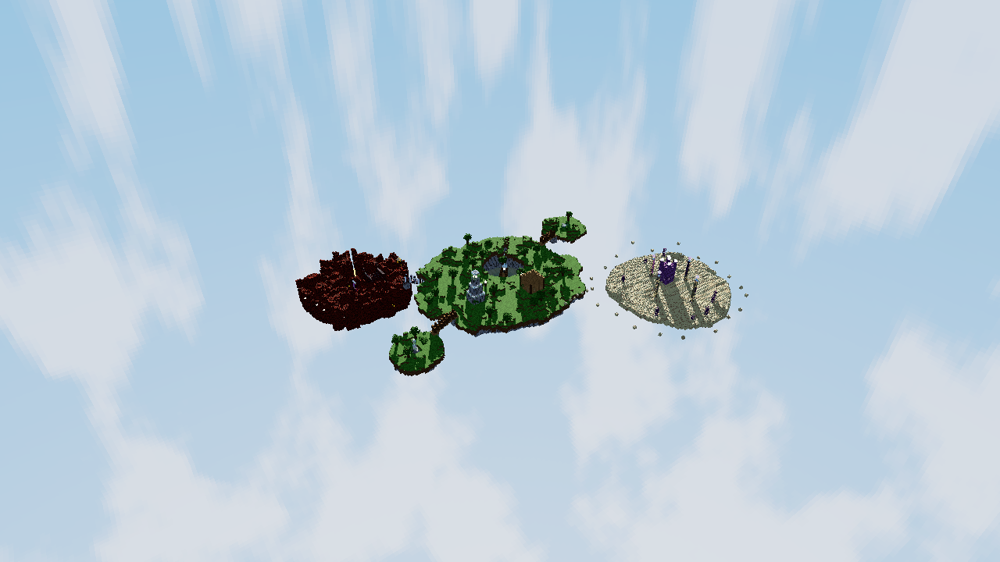
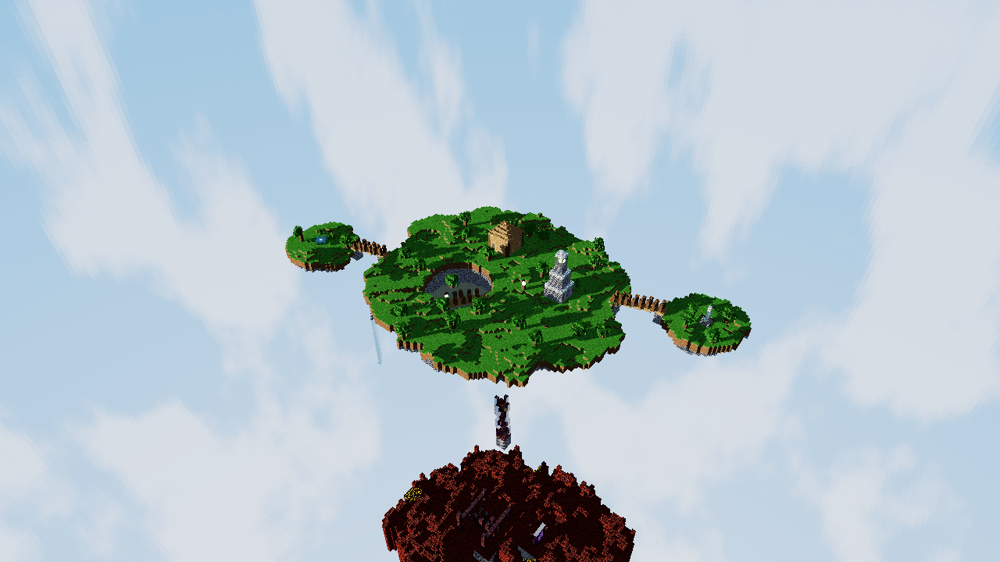
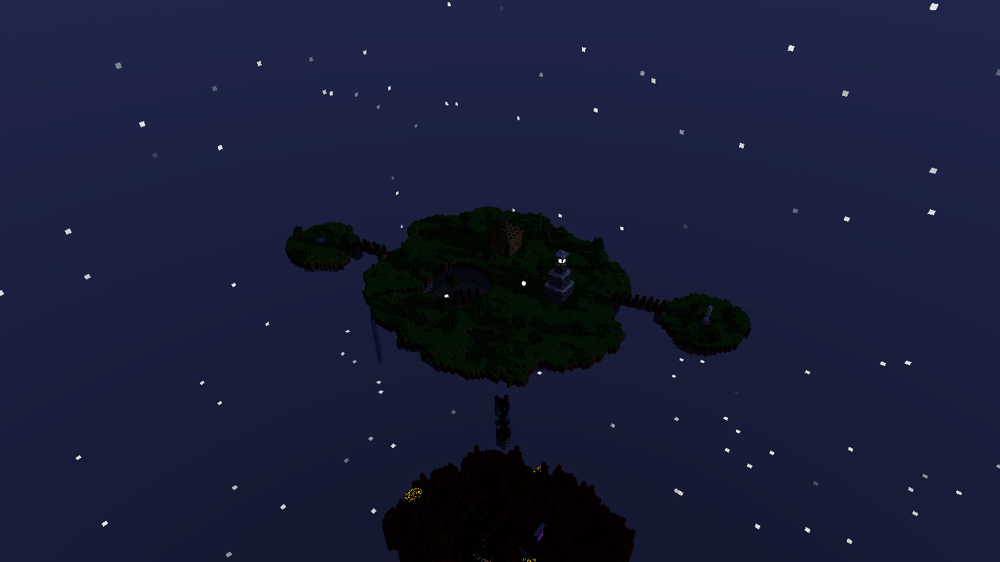
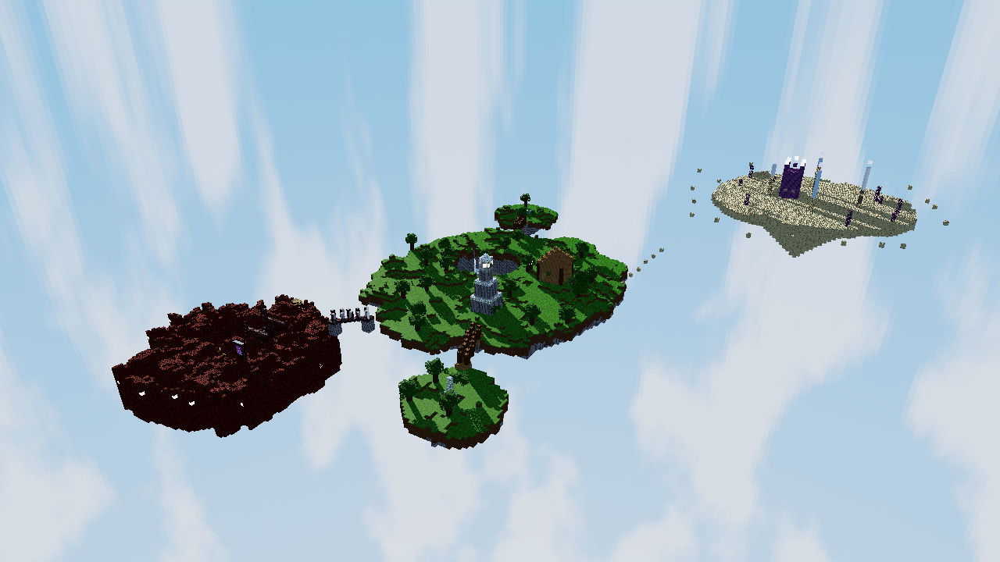
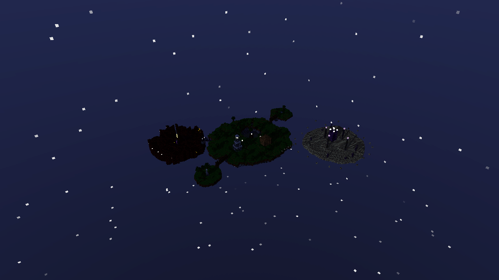

# El archipielago del faro

Diorama estilo Minecraft renderizado 100% con raytracing en CPU, escrito en
Rust desde cero (sin librerias externas para la logica: matematica,
texturas, ruido, PRNG, paralelismo y raytracing son todo codigo propio).
Cinco islas flotantes generadas proceduralmente, cada una con su propio
perfil de terreno: la isla principal (faro, lago con cascada, muelle,
casita, dos islas satelite), una isla del Nether (portal, lago de lava,
ruinas de fortaleza) y una isla del End (pilares con cristales flotantes,
mini ciudad de purpur), unidas por puentes y caminos de bloques flotantes.



## Video

<!-- VIDEO AQUÍ -->

## Requisitos

- Rust (edition 2021) con `cargo`.
- La unica dependencia externa es `raylib` (ventana, teclado/mouse y
  framebuffer). Todo lo demas -- matematica, texturas, PNG, ruido, PRNG,
  paralelismo, raytracing -- es codigo propio sobre la std.

## Como correr

```
cargo run --release
```

Abre una ventana con la escena en vivo. Tambien hay dos modos sin ventana,
utiles para revisar el trabajo o medir rendimiento:

```
# Renderiza un frame a PNG y termina (--dist hasta ~radio_principal x 9
# para que las 5 islas entren en cuadro, ver Controles)
cargo run --release -- --render salida.png --yaw 235 --pitch 30 --dist 260 --width 1280 --height 720 [--night] [--seed 7] [--no-normalmaps]

# Renderiza 30 frames desde 3 vistas fijas e imprime ms/frame promedio y FPS equivalente
cargo run --release -- --bench
```

## Controles

| Tecla / accion | Efecto |
|---|---|
| A / D o flechas izq/der | Rotar el diorama (yaw) |
| W / S o flechas arriba/abajo | Cambiar el angulo de camara (pitch) |
| Q / E o rueda del mouse | Zoom (alcanza para ver las 5 islas a la vez) |
| R | Activa/desactiva la auto-rotacion |
| T | Alterna dia / noche |
| N | Activa/desactiva los normal maps |
| G | Regenera las 5 islas con una nueva semilla derivada |
| 1 / 2 / 3 | Calidad baja / media / alta |
| 4 / 5 / 6 | Centra la camara (con transicion suave) en la isla principal / Nether / End |
| Esc | Salir |

El HUD (arriba a la izquierda, fuente bitmap 5x7 propia) muestra FPS, ms por
frame, modo de resolucion activo, resolucion interna, semilla, modo dia/
noche, calidad, normal maps on/off y el tiempo de generacion del terreno.

## Materiales

Cada material tiene su propia textura (16x16, generada por codigo si no hay
un `.bmp` en `assets/textures/`) y sus propios parametros de shading. 24 en
total, organizados por donde viven en la escena.

### Base (isla principal y satelites)

| Material | Textura | Albedo | Specular (coef/exp) | Transparencia | Reflectividad | IOR | Emision |
|---|---|---|---|---|---|---|---|
| Grass | verde con variacion, lado con franja de tierra | verde/marron | 0.05 / 8 | 0 | 0 | 1.0 | - |
| Dirt | marron con ruido | marron | 0.03 / 6 | 0 | 0 | 1.0 | - |
| Sand | tostado claro | beige | 0.05 / 10 | 0 | 0 | 1.0 | - |
| Stone bricks | ladrillos con juntas oscuras, normal map | gris | 0.15 / 24 | 0 | 0.05 | 1.0 | - |
| Oak log | vetas verticales (lado), anillos (tapa), normal map | marron | 0.05 / 8 | 0 | 0 | 1.0 | - |
| Oak planks | tablas con juntas y vetas, normal map | marron claro | 0.08 / 12 | 0 | 0 | 1.0 | - |
| Leaves | verde con alpha cutout | verde | 0.02 / 4 | 0 | 0 | 1.0 | - |
| Water | ondas suaves, absorcion Beer-Lambert | azul-verde | 0.6 / 90 | 0.85 | 0.15 | 1.33 | - |
| Glass | marco claro, centro casi transparente | casi blanco | 0.6 / 120 | 0.92 | 0.06 | 1.5 | - |
| Glowstone | manchas amarillas brillantes | amarillo/naranja | 0 / 1 | 0 | 0 | 1.0 | (1.0, 0.85, 0.5) x 2.5 |
| Iron block | gris metalico con borde, normal map | gris claro | 0.4 / 60 | 0 | 0.55 | 1.0 | - |
| Lamp frame | marco oscuro, centro con cutout | gris oscuro | 0.1 / 20 | 0 | 0 | 1.0 | - |

### Nether

| Material | Textura | Albedo | Specular (coef/exp) | Transparencia | Reflectividad | IOR | Emision |
|---|---|---|---|---|---|---|---|
| Netherrack | rugosa, pozos oscuros, normal map | rojo oscuro | 0.04 / 6 | 0 | 0 | 1.0 | - |
| Nether bricks | ladrillo con juntas, normal map | rojo oscuro | 0.12 / 20 | 0 | 0.03 | 1.0 | - |
| Lava | ondas, opaca | naranja intenso | 0.3 / 40 | 0 | 0 | 1.0 | (1.0, 0.45, 0.08) x 3.2 |
| Obsidian | casi negra con motas moradas | negro/morado | 0.5 / 80 | 0 | 0.35 | 1.0 | - |
| Portal | normal map propio en remolino "magico" | morado translucido | 0.4 / 30 | 0.85 | 0.05 | 1.1 | (0.55, 0.15, 0.85) x 0.6 |
| Magma | grietas via mapa de emision separado del albedo | roca oscura + grietas | 0.1 / 10 | 0 | 0 | 1.0 | solo en las grietas |
| Basalt | rayado vertical por columnas | gris azulado | 0.1 / 14 | 0 | 0 | 1.0 | - |

### End

| Material | Textura | Albedo | Specular (coef/exp) | Transparencia | Reflectividad | IOR | Emision |
|---|---|---|---|---|---|---|---|
| End stone | motas oscuras dispersas, normal map | amarillo palido | 0.06 / 10 | 0 | 0 | 1.0 | - |
| Purpur | cuadricula, normal map | morado | 0.25 / 30 | 0 | 0 | 1.0 | - |
| End crystal | gradiente radial | rosa/morado | 0.7 / 100 | 0.6 | 0.5 | 1.6 | (0.9, 0.55, 1.0) x 1.8 |
| End rod | bloque entero, lampara | blanco | 0.3 / 40 | 0 | 0 | 1.0 | (0.9, 0.95, 1.0) x 2.0 |
| Chorus | planta con alpha cutout | morado | 0.05 / 6 | 0 | 0 | 1.0 | - |

Normal map real (derivado por Sobel de la propia textura, o cargado desde
`assets/textures/<nombre>_n.bmp` si existe) en: `stone_bricks`,
`oak_planks`, `oak_log`, `iron_block`, `netherrack`, `nether_bricks`,
`end_stone`, `purpur`. El `portal` tiene un normal map propio generado
aparte (no derivado del albedo): un remolino via atan2/seno/coseno, para
que la refraccion se vea distorsionada en vez de plana.

## Tecnicas usadas

- **DDA multi-isla (Amanatides & Woo)**: cada isla es su propia grilla de
  voxeles con un offset entero que la ubica en el mundo (`src/islands.rs`).
  Un rayo primero se prueba contra el AABB de cada isla (sin asignar
  memoria, ordenado por t de entrada) y solo corre el DDA voxel a voxel
  dentro de las que realmente puede llegar a tocar, cortando apenas ninguna
  candidata restante puede mejorar el mejor hit encontrado. Sombras,
  reflejos y refracciones cruzan islas sin logica especial (un rayo no sabe
  ni le importa de que isla sale o en cual pega).
- **Fresnel (Schlick) y Snell**: la reflexion y la refraccion se calculan
  juntas -- Snell da la direccion refractada con el IOR del material,
  Fresnel-Schlick reparte cuanta energia va a reflexion y cuanta a
  refraccion segun el angulo de incidencia; la reflexion interna total
  redirige toda la energia a reflexion.
- **Beer-Lambert**: la luz que atraviesa un medio transparente (agua,
  portal) se atenua por canal segun la distancia real recorrida dentro del
  volumen.
- **Normal maps con TBN**: cada cara del cubo tiene una tangente/bitangente
  fija coherente con sus UV; el normal map (cargado, derivado por Sobel de
  la textura, o generado aparte como el remolino del portal) perturba la
  normal en ese espacio antes de calcular difusa, especular, reflexion y
  refraccion.
- **Emision por mapa**: ademas de la emision plana por material (glowstone,
  lava, end_rod, end_crystal), el magma usa un mapa de emision separado del
  albedo (mismo patron de grietas, pixel a pixel) para que solo las grietas
  brillen, no todo el bloque.
- **Cubemap**: el skybox es un cubo de 6 caras de 256x256, generado con
  fBm (nubes) y un gradiente sesgado hacia mas saturacion cerca del cenit,
  un campo de estrellas por hash y discos de sol/luna con glow; se usa para
  todo rayo que no pega, incluidos los reflejados.
- **Perlin / fBm, tres perfiles distintos**: ruido Perlin 2D/3D con
  permutacion generada desde una semilla (PCG32 propio). La isla principal
  usa fBm suave normal; el Nether pliega el fBm sobre si mismo ("ridged",
  `1.0 - fbm.abs()*2.0`) para picos filosos y grietas; el End usa muy poca
  amplitud y casi nada de deformacion de borde para una loma achatada.
- **Paralelismo por tiles**: el framebuffer se reparte en tiles de 16x16
  tomados de una cola atomica (`AtomicUsize`) por `std::thread::scope`, sin
  `Mutex` en el camino caliente.
- **Resolucion adaptativa**: la ventana siempre corre a resolucion real (1:1,
  minimo 1280x720). Mientras la camara se mueve, renderiza a una fraccion
  segun calidad (1/4, 1/2, 3/4) y escala con nearest-neighbor (nunca
  bilineal); al soltar, un pase a resolucion completa con supersampling
  (1x/2x2/3x3 rotado segun calidad). El HUD se dibuja despues del escalado,
  siempre nitido.

## Rendimiento

Medido con `cargo run --release -- --bench` en esta maquina (20 hilos
detectados), sobre la escena completa (9 islas: principal + 2 satelite + 2
puentes + Nether + su puente + End + su camino flotante):

| Resolucion | ms/frame | FPS equivalente |
|---|---|---|
| 480x270 | 21.6 | ~46 |
| 640x360 (resolucion del pase "en movimiento" a calidad media) | 36.7 | ~27 |
| 1280x720 | 143.0 | ~7 |

Rotando a calidad media la ventana corre a resolucion reducida (~27 FPS
equivalente, fluido); el pase de resolucion completa con supersampling solo
corre una vez, al soltar la camara. Agregar el Nether y el End (4 islas mas,
una decena de materiales mas) practicamente no cambio el costo respecto a
la escena de 5 islas de la parte 2 -- el filtro por AABB hace que la
mayoria de los rayos ni prueben las islas lejanas. Detalle completo en
`BENCHMARK.md`.

## Galeria

| De dia | De noche |
|---|---|
|  |  |
|  |  |
|  |  |
|  |  |

### Nether y End

| | |
|---|---|
|  |  |
|  |  |

## Guion sugerido para el video

1. Arrancar con la vista general (zoom alejado, las 5 islas -- principal,
   sus 2 satelites, Nether y End -- en un solo cuadro) unos segundos quieto.
2. Activar auto-rotacion (`R`) para dar una vuelta completa al archipielago.
3. Detener la rotacion. Tecla `5` para centrar suavemente la camara en el
   Nether, alternar a noche (`T`) y hacer zoom (`Q`/`E`) hacia el portal, el
   lago de lava y las ruinas -- mostrar el brillo de la lava/magma
   iluminando la roca alrededor.
4. Tecla `6` para centrar en el End: zoom hacia los pilares con los
   cristales flotantes y la torre de purpur con las lamparas de end_rod.
5. Tecla `4` para volver a la principal: acercarse al faro (glowstone a
   traves del vidrio) y al lago (refraccion del fondo, cascada por el
   borde).
6. Cruzar los puentes hacia el monolito de hierro pulido (reflejo) y el
   jardin con la fuente.
7. Alternar normal maps (`N`) de cerca sobre nether_bricks o stone_bricks
   para mostrar la diferencia con luz rasante.
8. Regenerar el archipielago (`G`) un par de veces para mostrar que las 5
   islas y todas sus estructuras se reconstruyen con cualquier semilla.
